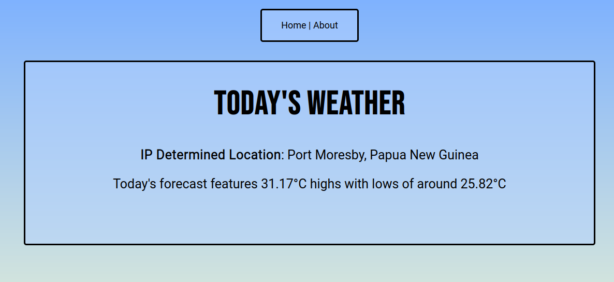

# Simple Weather App
A basic weather app to provide weather information using the Open-Meteo API. It uses IP to determine location.

# About
The app's purpose was to for me to learn more about using APIs and Python, along with the Flask framework. It uses the aformentioned Open-Meteo API for weather tracking, as well as IPFY and IP-API for determining location. 

Right now the app is very basic, and uses datetime determine today's date, and accesses the 2M (surface level) highs and lows for the IP determined location.

V3.0

# TODO
- Implement week forcast
- Speed up program (one major bottleneck is that the location and weather calls are made every time the home page is loaded)
- ~~- Improve design (Make it look pretty)~~

